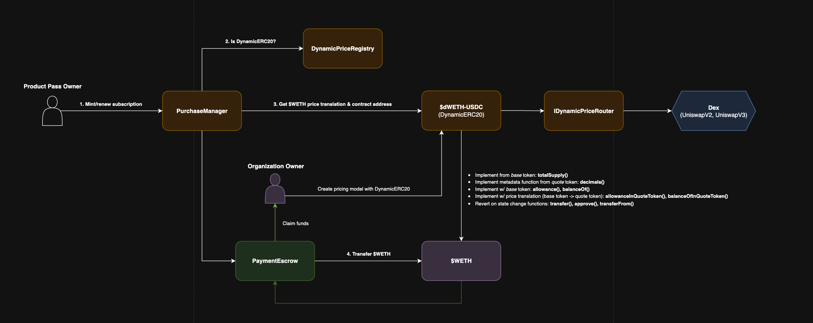

# ProductMint - DynamicERC20

DynamicERC20 is a concept unique to ProductMint allowing organizations to create pricing models that target a specific price. DynamicERC20s are not mintable or transferable. Currently we support Uniswap V2 and Uniswap V3.

## How it works

DynamicERC20 are composed of two ERC20s:

- The base token (e.g. WETH)
- The quote token (e.g. USDC)

The base token is the token that is used for payment. The quote token is the token that is used to price the subscription. An organization can create a pricing model using the DynamicERC20 token based on the price of the quote token. Then, whenever the subscription is minted or renewed, the system will charge the base token based on the price of the quote token.

### Example

Assume an organizations wants to be paid in 100 USDC worth of WETH for their subscription. To achieve this, the organization would create the pricing model using the dynamic pricing token `dWETH-USDC` with a price target of 100. Then, whenever the subscription is minted or renewed, 100 USDC worth of WETH will be charged.

## Architecture

All DynamicERC20s require a dynamic pricing router to get the price of the tokens via a dex such as Uniswap V2 or Uniswap V3. Once the DynamicERC20 is deployed and registered, the system will check if the pricing model token is registered. If so, the system will use the quote token pricing to get the price in terms of the base token charging accordingly.

## DynamicERC20 Contract Addresses

### Base - Mainnet
- _dWETH-USDC_ (UniswapV2): `0x3eB0f547a95A9a52cA19E65917f5a06Cb28f06d2`
    - Base (_WETH_): `0x4200000000000000000000000000000000000006`
    - Quote (_USDC_): `0x833589fCD6eDb6E08f4c7C32D4f71b54bdA02913`

### Base - Sepolia
- _dMINT-USDC_ (UniswapV2 Mock): `0x8510eacF095f5d642c2c503316238d1bdaA69913`
    - Base (_MINT_): `0xfEf7A1A463ad76814a959abbF04f75C1f769e057`
    - Quote (_USDC_): `0xD89A17a42087d03CBC8e97699e85d98f73466fCe`