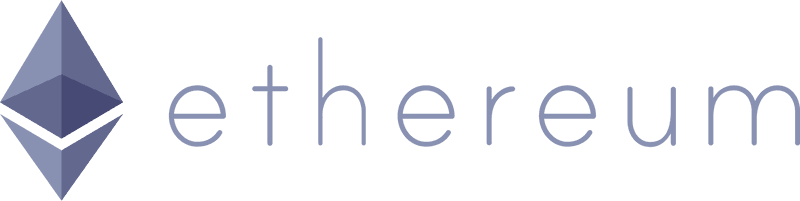

# Payment Escrow Fees

Fees are collected on each transaction when a Product Pass is minted or a subscription is renewed or upgraded.

**NOTE:** This is the only cost to use the ProductMint system paid only when you get paid.

### Fees by Chain
The current fee structure for the Payment Escrow contract across EVM based chains for each token that is supported is listed below. 

 

### Base

<table>
    <tr>
        <th>Token Symbol</th>
        <th>Address</th>
        <th>Fee</th>
    </tr>
    <tr>
        <td>USDC</td>
        <td>0x833589fCD6eDb6E08f4c7C32D4f71b54bdA02913</td>
        <td>2.5%</td>
    </tr>
     <tr>
        <td>WETH</td>
        <td>0x4200000000000000000000000000000000000006</td>
        <td>3.5%</td>
    </tr>
</table>

 

### Ethereum

<table>
    <tr>
        <th>Token Symbol</th>
        <th>Address</th>
        <th>Fee</th>
    </tr>
    <tr>
        <td>USDC</td>
        <td>0xA0b86991c6218b36c1d19D4a2e9Eb0cE3606eB48</td>
        <td>6.5%</td>
    </tr>
     <tr>
        <td>WETH</td>
        <td>0xC02aaA39b223FE8D0A0e5C4F27eAD9083C756Cc2</td>
        <td>7.5%</td>
    </tr>
</table>

### Interested in adding a new token?

Please join our [Discord](https://discord.gg/dEZpyh9Y35) and talk with us!